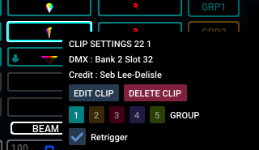
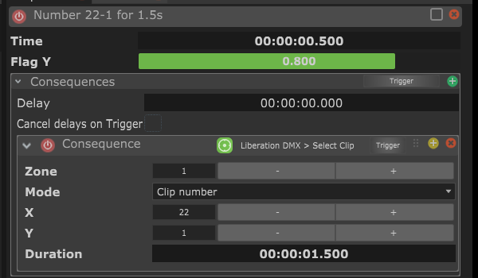
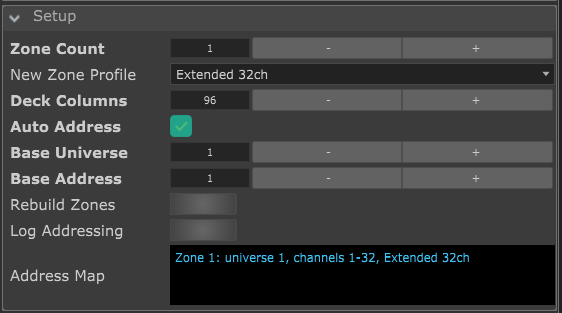

# Liberation DMX for Chataigne

**Requires Liberation 1.2.1 Build 96 or higher**  

Note: this is not a replacement of Afturmath/DamLaser's [Liberation Chataigne Module](https://github.com/DamLasers/Liberation-Chataigne-Module).
Afturmath's module drives liberation via its MIDI controller input system and reads MIDI feedback from Liberation, making it ideal for integrating custom command surfaces and controller based live performance workflows in Chataigne.  

By contrast, this Chataigne-Liberation-DMX module drives Liberation via its DMX input system, allowing absolute and deterministic control over global laser/zone XY, intensity, clip, etcetera - making it more suitable for animation / timeline based workflows in Chataigne. It was mostly born out of the need to animate the X/Y position and content of specific laser zones in Liberation directly from a Chataigne timeline. 

Choose the module that suits your particular setup the best, or run both (although note the DMX input system is its own renderer entirely in Liberation, so it will override any midi-triggered clips).

## What it is
Chataigne module that drives [Liberation](https://www.liberationlaser.com) laser
software over Art-Net using its DMX Input system. Up to 8 zones, each one mapped to
a Liberation DMX Input profile row (Basic 16ch or Extended 32ch). Art-Net over the network so no MIDI or audio loopback device and setup required.

Liberation's underlying DMX system and intricacies are completely abstracted away so you never deal with raw DMX values, scaling, etc anywhere.
Clips are picked by Liberation's own clip number
rather than Gobo Bank / Gobo Select values, position is a normalized `-1..1` Point2D
written to the 16-bit coarse/fine channel pairs, and channel addressing is handled for
you.  

Includes features to automatically handle arming and intensity channels as well so all
you need to do is select / trigger a clip and it's lasered. See [CHANNEL_MAP.md](CHANNEL_MAP.md)
for the wire-level detail.

## Install

**Chataigne**: 
- Download the latest release from the releases section to the right
- extract the chataigne-liberation-dmx folder from the zip into your `Documents/Chataigne/modules/` folder
- Restart Chataigne or use File > Reload Custom Modules
- Add the module to your project, it's under Software > Liberation DMX
- Set up your desired laser/zone count and start triggering clips via sequence mappings, triggers, OSC, etc 

Here's a zone armed on clip `21-1`:

**Liberation**: 

- In the top left hit Liberation > Settings > DMX Input Settings
- Ensure *Enable DMX Input* is enabled, with Art-Net selected for protocol
- Click the DMX Input Settings button (or click View > DMX Input Settings) and add as many profiles as you have lasers / zones, choosing the desired channel count (32 channel profile recommended):

## Using it

Set Zone Count, then drive each `Zones > Zone N` container: Arm, Intensity,
Clip, Colour, Position, Scale, Rotation, Zoom, plus FX and Tempo on the Extended
profile. All of it is also exposed as Commands for Mappings and Sequences (you can also send commands to zone 0 to control all zones simultaneously) and over OSC/OSCQuery.

### Finding a clip

The module uses Liberation's X-Y clip deck coordinates to address clips. To see this just right click any clip in liberation, and the clip number is the very first line in clip deck X-Y format. Simply use that x-y number in chataigne. **Do not use the DMX values displayed here**. For example, to trigger the following clip from a timeline trigger, output to zone 1:

Enter those X-Y coordinate numbers (22-1) into your Chataigne trigger/mapping/etc using the
**Select Clip** command:

Select Clip has three modes:

- **Clip number** - the X / Y pair above, typed straight in
- **Clip list** - a dropdown of the whole deck by the same `x-y` names. The list is sized by
  Setup > Deck Columns
- **Stop clips** - clears whatever the zone is playing (and disarms it, see below) 

**Duration**: How long to play the clip before stopping it. 0 = forever. Selecting another clip on the same zone, Stop clips, Clear Clip or
Reset Zone all kill the clip as well.

With the default module configuration, selecting a clip like above is enough to put light in the air.
The **Arm Follows Clip** and **Intensity Follows Clip** automatically arm the zone and raise its Intensity on
every clip change, and stopping the clip (Stop clips, Clear Clip, or `None` on the zone) disarms it again.
*This means choosing a
clip immediately enables laser output for that zone*. Switch both options off in the module if you
want to drive Arm yourself. Master Intensity scales every zone on the way out without
touching the per-zone values.

## Universes / Addressing

The Auto Address option (enabled by default) stacks zones automatically from Base Universe/Address, spilling into the
next universe when a block would cross channel 512. This matches Liberation's DMX Input Settings behavior when adding profiles, so it typically shouldn't need to be modified. Turn it off to set Universe and
Start Address per zone by hand if you've modified the defaults in Liberation.

The **Setup > Address Map** box always shows every zone's universe, channel range and profile, exactly
as shown in Liberation's DMX Input window. Also shows any addressing problem (a missing output
universe, an overlap, a block running past channel 512, etc). The Log Addressing button
prints the same thing to the Logger panel.

## Extra Info

- A zone/laser only outputs light if Arm is on, a clip is
  selected and Intensity is above zero. A silent rig is almost always Arm off or
  Clip = None
- A Chataigne enum answers to its option text over OSC, so anything selecting a
  clip by name needs `21-1`. `Clip X` / `Clip Y` are the easier OSC target — plain
  integers
- Scale 0 renders nothing. `1` is the clip as
  authored (the default), `0` collapses it to nothing, `-1` mirrors it
- Universes must exist under Module Parameters > Output Universes. Chataigne
  only transmits the universes listed there. One ships with the module
  (Liberation universe 1) and Address Map names any other universe you need to add.
  Hit Rebuild Zones afterwards
- DMX Type, Send Rate and Multicast are fixed at Art-Net, 44 Hz and off, and hidden along
  with Send On Change Only. Liberation drops a zone after 2 seconds without fresh data, so
  the stream has to be continuous. sACN is not supported
- The Art-Net Input and Pass-through sections of a stock DMX module are hidden too: this
  module only ever sends
- A clip that is on a Duration countdown stays on if the project is reloaded or the
  module script is reloaded before the time is up - the countdown lives in the script,
  not in the project
- Removed zones are blanked first. Lowering Zone Count, switching Extended to
  Basic, or re-addressing a zone zeroes the vacated channels, so nothing is left
  streaming an armed state with no UI attached to it
- You don't need a laser to verify anything: any Art-Net monitor on port 6454
  shows the block. Arm a zone and watch channel 1 go to 255

**Author: [Jon Sands / Fohdeesha](https://github.com/Fohdeesha)**

## License

GNU General Public License v3, see `LICENSE`. `icon.png` is Liberation's own logo
mark, used to identify the software this module talks to. It remains the property
of its owners and is not covered by the GPL grant.

## Links

- [Liberation](https://www.liberationlaser.com) and the [user manual](https://docs.liberationlaser.com)
- [Chataigne](https://benjamin.kuperberg.fr/chataigne/en) and the [custom module docs](https://benkuperberg.gitbook.io/chataigne-docs/modules/custom-modules/making-your-own-module)
