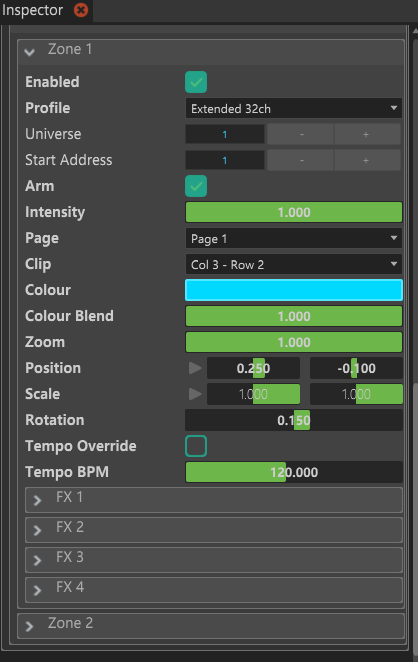
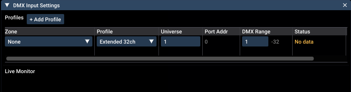

# Liberation DMX for Chataigne

Chataigne module that drives [Liberation](https://www.liberationlaser.com) laser
software over Art-Net using its **DMX Input** system. Up to **8 zones**, each one
mapped to a Liberation DMX Input profile row (Basic 16ch or Extended 32ch).

You never deal with the raw DMX. Clips are picked from **Page + Clip** dropdowns
instead of Gobo Bank / Gobo Select values, position is a normalized `-1..1` Point2D
written to the 16-bit coarse/fine channel pairs, and channel addressing is handled
for you. See [CHANNEL_MAP.md](CHANNEL_MAP.md) for the wire-level detail.

Written against **Liberation 1.2.1 Build 96**. ⚠️ The build number matters:
**1.2.1 Build 95 and older** accept the FX Param and Scale channels but ignore them.

## Install

**Chataigne**: copy this folder into `Documents/Chataigne/modules/`, hit
**File > Reload custom modules**, then add **Liberation DMX** from the module list
(under *Software*). Here's the module panel with a zone armed and a clip selected:

**Liberation**: open **View > DMX Input Settings** and add one profile row per
zone: the Liberation zone, the profile type (**Extended 32ch** unless you changed
it), the universe and the start address. **Setup > Log Addressing** in Chataigne
prints exactly what to enter here.

## Using it

Set **Zone Count**, then drive each `Zones > Zone N` container: Arm, Intensity,
Page + Clip, Colour, Position, Scale, Rotation, Zoom, plus FX and Tempo on the
Extended profile. All of it is also exposed as Commands for Mappings and Sequences
(the **Zone** parameter accepts **0** for all zones) and over OSC/OSCQuery.

With the default options, selecting a clip is enough to put light in the air.
**Arm Follows Clip** and **Intensity Follows Clip** arm the zone and raise its
Intensity on every clip change, and selecting `None` disarms it again. ⚠️ This
means choosing a clip immediately enables laser output for that zone. Switch both
options off if you want to drive Arm yourself. **Master Intensity** scales every
zone on the way out without touching the per-zone values.

**Auto Address** stacks zones automatically from Base Universe/Address, spilling
into the next universe when a block would cross channel 512. Turn it off to set
Universe and Start Address per zone by hand.

## Things worth knowing

- A zone renders only when its profile row is active, Arm is on, a clip is
  selected and Intensity is above zero. A silent rig is almost always Arm off or
  Clip = None.
- Scale 0 renders nothing. Scale is a size, not an offset: `1` is the clip as
  authored (the default), `0` collapses it to nothing, `-1` mirrors it.
  ⚠️ If you're upgrading from module 1.4.0 or earlier: `Scale` used to default
  to 0, and 1.2.1 Build 96 now applies that for real, so zones saved at 0 render
  nothing until set back to 1. The module logs a warning for any zone sitting at
  0 on both axes.
- Universes must exist under *Module Parameters > Output Universes*. Chataigne
  only transmits the universes listed there. One ships with the module
  (Liberation universe 1) and the log names any other universe you need to add.
  Hit **Rebuild Zones** afterwards.
- Leave DMX Type on Art-Net and leave *Send On Change Only* alone (hidden, off by
  default). Liberation drops a zone after 2 seconds without fresh data, so the
  stream has to be continuous. sACN is not supported.
- Removed zones are blanked first. Lowering Zone Count, switching Extended to
  Basic, or re-addressing a zone zeroes the vacated channels, so nothing is left
  streaming an armed state with no UI attached to it.
- After loading a project, the opening push can happen before the saved Output
  Universes exist. The module re-sends everything on the next parameter change,
  and **Rebuild Zones** forces it (it's OSC-addressable, so a startup State can
  fire it).
- You don't need a laser to verify anything: any Art-Net monitor on port 6454
  shows the block. Arm a zone and watch channel 1 go to 255.

## License

GNU General Public License v3, see `LICENSE`. `icon.png` is Liberation's own logo
mark, used to identify the software this module talks to. It remains the property
of its owners and is not covered by the GPL grant.

## Links

- [Liberation](https://www.liberationlaser.com) and the [user manual](https://docs.liberationlaser.com)
- [Chataigne](https://benjamin.kuperberg.fr/chataigne/en) and the [custom module docs](https://benkuperberg.gitbook.io/chataigne-docs/modules/custom-modules/making-your-own-module)
